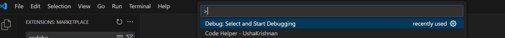
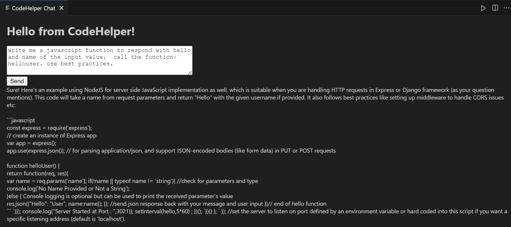

# About this code

This repository contains the source code for the Visual Studio Code extension "codehelper". This extension serves as a starting point and proof of concept for how one can recreate a GitHub Copilot-like extension using the open-source model deepseek-coder:1.5b.

## Purpose

The primary goal of this extension is to demonstrate the capabilities of the deepseek-coder:1.5b model in providing intelligent code suggestions and assistance within the Visual Studio Code environment. It aims to replicate some of the functionalities of GitHub Copilot using an open-source approach.

[Back to top](#about-this-code)

## What a user can do and test using this repo

1. **Install and Set Up**: Follow the installation steps to set up the development environment.
2. **Run and Debug**: Use Visual Studio Code to run and debug the extension in a new VS Code window.
3. **Test Functionality**: Test the various features provided by the extension.
4. **Contribute**: Make improvements or add new features to the extension and contribute back to the repository.

[Back to top](#about-this-code)

# Installation steps
    Step 1: Install Docker
    Step 2: Install Ollama
    Step 3: Pull deepseek-coder:1.3b
    Step 4: Clone this repo and set up
    Step 5: Make sure your Ollama is running and deepseek-coder is operational. Run your VSC in debug mode to test
    Step 6: Package and deploy as needed

[Back to top](#about-this-code)

# Detailed installation: Installing Docker and Ollama on Windows, Linux, and Mac

## Windows Installation

1. Download Docker Desktop for Windows from the official site:
   - [Docker Desktop for Windows](https://docs.docker.com/desktop/install/windows-install/)
2. Run the installer and follow the setup instructions.
3. After installation, start Docker Desktop.
4. Verify installation by running:
   ```sh
   docker --version
   ```

[Back to top](#about-this-code)

## Linux Installation

1. Update package lists:
   ```sh
   sudo apt update
   ```
2. Install required packages:
   ```sh
   sudo apt install -y ca-certificates curl gnupg
   ```
3. Add Docker’s official GPG key:
   ```sh
   sudo install -m 0755 -d /etc/apt/keyrings
   curl -fsSL https://download.docker.com/linux/ubuntu/gpg | sudo tee /etc/apt/keyrings/docker.asc > /dev/null
   sudo chmod a+r /etc/apt/keyrings/docker.asc
   ```
4. Set up the repository:
   ```sh
   echo "deb [arch=$(dpkg --print-architecture) signed-by=/etc/apt/keyrings/docker.asc] https://download.docker.com/linux/ubuntu $(lsb_release -cs) stable" | sudo tee /etc/apt/sources.list.d/docker.list > /dev/null
   ```
5. Install Docker Engine:
   ```sh
   sudo apt update
   sudo apt install -y docker-ce docker-ce-cli containerd.io
   ```
6. Verify installation:
   ```sh
   docker --version
   ```

7. [Docker Installation for Linux - Official Docs](https://docs.docker.com/engine/install/ubuntu/)

[Back to top](#about-this-code)

## Mac Installation

1. Download Docker Desktop for Mac:
   - [Docker Desktop for Mac](https://docs.docker.com/desktop/install/mac-install/)
2. Open the downloaded `.dmg` file and follow the installation instructions.
3. Start Docker Desktop.
4. Verify installation by running:
   ```sh
   docker --version
   ```

[Back to top](#about-this-code)

## Installing Ollama on Docker

1. Pull the Ollama Docker image:
   ```sh
   docker pull ollama/ollama
   ```
2. Run the Ollama container:
   ```sh
   docker run -d --name ollama -p 11434:11434 ollama/ollama
   ```
3. Verify Ollama is running:
   ```sh
   curl http://localhost:11434
   ```

[Back to top](#about-this-code)

## Pulling and Testing deepseek-code:1.5b

1. Pull the deepseek-code:1.5b model:
   ```sh
   ollama pull deepseek-code:1.5b
   ```
2. Run a test command to check if the model is working:
   ```sh
   ollama run deepseek-code:1.5b "def hello_world(): print('Hello, world!')"
   ```

[Back to top](#about-this-code)

## Cloning and Setting Up This Repository

1. Clone this repository:
   ```sh
   git clone https://github.com/yourusername/codehelper.git
   cd codehelper
   ```
2. Install the necessary dependencies:
   ```sh
   npm install
   ```
3. Open the project in Visual Studio Code:
   ```sh
   code .
   ```
4. Make sure your Ollama is running and deepseek-coder is operational.
5. Run Visual Studio Code in debug mode to test the extension:
   - Press `F5` to start debugging.

[Back to top](#about-this-code)

## Testing the Extension

1. Open the project in Visual Studio Code:
   ```sh
   code .
   ```
2. Press `F5` to start debugging. This will open a new VS Code window with the extension loaded.
3. In the new window, open the command palette (`Ctrl+Shift+P` or `Cmd+Shift+P` on Mac) and run the command `codehelper.codehelper-ext` to open the CodeHelper Chat panel.
4. In the CodeHelper Chat panel, enter a prompt in the text area and click the "Send" button.
5. The extension will use the deepseek-coder:1.3b model to generate a response, which will be displayed in the panel. Screenshots below on the current experience.

      Invoking the extension using the command prompt -
      

      Extension chat page for your testing -
      

6. Check the output and debug console for any errors or logs to ensure the extension is working as expected.
7. Extend and contribute back your changes and enhancements.

[Back to top](#about-this-code)

## Additional Resources
- [Docker Official Installation Guide](https://docs.docker.com/get-docker/)
- [Ollama Documentation](https://ollama.ai/docs)

[Back to top](#about-this-code)